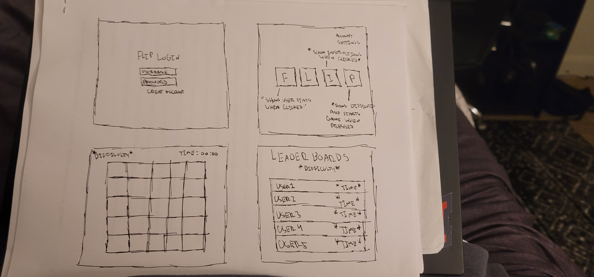

# Flip - Card Memory Game

### Elevator pitch

Have you ever been bored while attending one of your CS classes and said to yourself: "I wish I could play a game that tests my intellect and proves that I have a better memory than all my friends." Flip is a card memory game that tests your ability to remember symbols and their locations. Flip also tracks your preforamce and posts the best scores on a public leaderboard in order to compete with your freinds and satify your competitive itch.

### Design

### Key features

- Secure login over HTTPS
- Ability to view player stats and game instructions
- Ability to choose game difficulty
- Ability to play game at chosen difficulty
- Display of leaderboards and fastest times for each difficulty
- Notifications of players logging on and beating time records
- High scores for each user stored

### Technologies

I am going to use the required technologies in the following ways.

- **HTML** - Uses correct HTML structure for application. Four HTML pages. One for login, one for main menu, one for the game, and one for the leaderboard.
- **CSS** - Styling that is readable and minimal as to not become too congested or distracting. Uses appealing color choices and scales to different sized screens.
- **JavaScript** - Provides login, main menu functionality, and gameplay.
- **Service** - Backend service with endpoints for:
  - login
  - receiving scores
  - Tieing scores with correct users
- **DB/Login** - Stores users login info, scores, and stats. Login info is stored securily. 
- **WebSocket** - Users are notified of other players activity and scores in real-time.
- **React** - Application correctly ported to the React Framework.

## HTML deliverable

For this deliverable I built out the structure of my application using HTML.

- **HTML pages** - 
- **Links** - 
- **Text** - 
- **Images** - 
- **DB/Login** - Login page with username and password. Leaderboard and user stats pulled from database.
- **WebSocket** - Home page will display other user logins and scores real-time.
